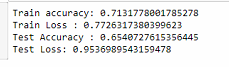

# Facial-Expression-Recognition-System-Progression
A repo to maintain the progressiveness of facial expression detection model. 

# Summary of all the results obtained

This section will visualise all the accuracies obtained from all the 6 distinct models from 4 different datasets as discussed in the previous section.

_Figure 54 Summary of all six model accuracies_

# Progress and Results obtained so far

This section will look at the progress and results obtained through the progress over this semester.

The general architecture's code snippet used for this project is as follows:

_#build our model_

model = Sequential()

_#1st convoltion layer_

model.add(Conv2D(64,(3,3), input\_shape=(48,48,1),padding='same'))

model.add(BatchNormalization())

model.add(Activation('relu'))

model.add(MaxPooling2D(pool\_size=(2,2)))

_#To prevent overfitting add a dropout_

model.add(Dropout(0.5))

_#2nd convolution layer_

model.add(Conv2D(128,(5,5),padding='same'))

model.add(BatchNormalization())

model.add(Activation('relu'))

model.add(MaxPooling2D(pool\_size=(2,2)))

model.add(Dropout(0.5))

_#3rd convolution layer_

model.add(Conv2D(512,(3,3),padding='same'))

model.add(BatchNormalization())

model.add(Activation('relu'))

model.add(MaxPooling2D(pool\_size=(2,2)))

model.add(Dropout(0.5))

_#4th convolution layer_

model.add(Conv2D(512,(3,3),padding='same'))

model.add(BatchNormalization())

model.add(Activation('relu'))

model.add(MaxPooling2D(pool\_size=(2,2)))

model.add(Dropout(0.5))

_#Now we to flatten the volume to pass to the fully connected layer_

model.add(Flatten())

_#Fully connected layer_

model.add(Dense(256))

model.add(BatchNormalization())

model.add(Activation('relu'))

model.add(Dropout(0.5))

model.add(Dense(512))

model.add(BatchNormalization())

model.add(Activation('relu'))

model.add(Dropout(0.5))

_#Fore creating output_

model.add(Dense(7,activation='softmax'))

_#Optimizer_

opt = Adam(lr=0.0005)

model.compile(optimizer =opt , loss='categorical\_crossentropy' , metrics=['accuracy'])

The visualization of the above code snippet is as show below :

_Figure 33 Architecture designed for this project based on the above code snippet_

In the subsequent sections we will be looking at results we have obtained based on the four different datasets mentioned earlier. Each dataset was trained to build one model which will help me in future to gauge which datasets can be used to build the final robust model.

## Results using the FER-2013 Dataset

For the FER-2013 we will be looking at results obtained from the three distinct models I have trained.

### Model 1 : FER-2013 with unbalanced Disgust class

The initial model focussed on purely using the FER-2013 dataset. As can be seen from the screenshot below the Disgust class is clearly unbalanced in comparison to other 6 classes. 

_Figure 34 Unbalanced disgust dataset_

Results :

The results will show the loss and accuracies for both training and validation sets.

_Figure 35 Accuracy and Loss after using reduce learning-rate call back function_

**Results/Findings for Model 1:**

- From model 1 , we can see the **validation accuracy is around 0.56%**
- Reduced learning rate helps attaining a smoother graph
- However, it is noticed validation error and accuracy was better than training. Two reasons could be that:
  - The training set had many 'hard' cases to learn
  - The validation set had mostly 'easy' cases to predict

### Model 2 : FER-2013 with Data Augmentation

In this model data augmentation was added to increase the variety of images for the Disgust class as shown below.

_Figure 36 Data Aumentation done on Disgust class to improve number of images and reduce class imbalance_

**Results/Findings for Model 2:**

_Figure 37 Results of Model 2_

_Figure 38 Performance Summary of Model 2_

**Test Accuracy:**

_Figure 39 Test accuracy of model 2_

Model 2 performed with an **test/validation accuracy of 65%** which is better than Model 1. This can be due to data augmentation to remove the class imbalances.

### Deployment of Model 1 and Model 2:

Both model 1 and model 2 were deployed for real time facial expression detection. For testing purpose, we used the video found on YouTube which mimics the 7 different facial expressions as it will help act as a ground truth.

**Results of Model 1 performance:**

Model 1 performed poorly which can be seen from the screenshots below. The screenshots below show Model 1 misclassifying Anger, Sad and Surprise for Disgust, Angry and Surprise respectively

_Figure 40 Realtime detected results of Model 1_

**Results of Model 2 performance:**

Model 2 performed better than expected where the misclassifications made by Model 1 were not repeated.

### Model 3: FER-2013 with Random Oversampling and data-augmentation

Random oversampling is another widely adopted technique for dealing with highly unbalanced datasets is called resampling. In this case, we randomly resampling existing datasets with data augmentation to solve the imbalance in dataset.

_Figure 41 Illustration of oversampling_

_Figure 42 Number of images in each class before and after applying Oversampling with data augmentation_

**Results/Findings for Model 3:**

_Figure 43 Loss and Accuracy plots for Model 3_

_Figure 44 Results for Model 3_

We could see Model 3 has good metrics with **test accuracy of 74%.**

However, we can see there is a some overfitting happening and if deployed it might not perform as expected.

To summarise my findings using the FER-2013 dataset to build my model, there were two major flaws with the FER-2013 dataset. They are:

- Firstly, were the imbalanced classes
- Lastly was that the FER2013 was mainly scraped from google search images and there were many inaccuracies due to mislabelled images

Therefore, we would try to build models on better datasets such as JAFFE, CK+, and KDEF for our final FER model.

## Results using the CK+ and JAFFE Dataset (Model 4)

This will be **the 4**** th **** experimental model** where we will be building based on the CK+ and the JAFFE dataset. The CNN architecture used is similar as before with slight modifications done to the input image size. This experimental model aims to let me better decide how the performance of this dataset.

**Current Results :**

_Figure 45 Accuracy and Loss plots for Model 4_

_Figure 46 Test accuracy of 63% for Model 4_

_Figure 47 Predicted results for Model 4_

As seen from the above three figures, Model 4's has a **test/validation accuracy of 64%.** This result look promising since the combined size of CK+ and JAFFE is 10 times smaller than the FER-2013 dataset and has more accurately labelled images. Thus, further modification can be done on the CNN architecture to help improve on accuracies. This will be further discuss in the future works section.

## 6.3 Results using the KDEF Dataset (Model 5)

This will be **the 5**** th **** experimental model** where we will be building based on the KDEF dataset. The CNN architecture used is similar as before with slight modifications done to the input image size. This experimental model aims to let me better decide how the performance of this dataset.

**Current Results:**

_Figure 48 Accuracy and Loss plots for Model 5_

_Figure 49 Low validation accuracy of Model 5_

Model 5 performed with a **test/validation score of 54 %.** Again this results also looks a bit promising since the size of KDEF dataset is 7 times smaller than the FER-2013 dataset and has more accurately labelled images.

Concluding from Model 4(CK+ and JAFFE dataset) and Model 5(KDEF Dataset), there is a need to modify our CNN architecture to better perform on these good datasets. The solution is to use transfer learning by creating bottleneck features from VGG-16 model​.

## 6.4 Results using the KDEF Dataset using Transfer Learning (Model 6):

This will be our **6**** th **** experimental Model** which will built using the KDEF dataset and applying transfer learning from the pre-trained VGG-Face model. This particular Model 6 will also act as a proof of concept to determine the effectiveness of transfer learning in improving the overall accuracy of the model itself.

As discussed in [section 3.5](#_3.5_Literature_Review), transfer learning helps us to build a deeper model based on already trained and tested models. Transfer learning will be done using VGG-Face which is a powerful CNN architecture based on the VGG-16 model with 16 layers and 138 million parameters.

To use the VGG-Face model for our classification problem, we will be freezing the lower full connected layers to attach our own fully connected layer. Following this, we will use a smaller learning rate to then retrain the attached fully connected layer. A overview of the explanation can be seen from the figure below.

_Figure 50 Transfer learning overview_

_Figure 51 Code snippet demonstrating how I added my own fully connected layer on top of the VGG-Face model_

**Current Results:**

_Figure 52 Loss and Accuracy plot for Model 6_

_Figure 53 Validation/Test Accuracy of Model 6_

Model 6 performed with a **test/validation accuracy of 82.5%.** This is a tremendous improvement in performance compared to Model 5 where we used our initial base CNN architecture.

Thus from Model 6, the need for a deeper model is required to help improve the accuracy of the model. In addition Model 6 helped in showing how beneficial is transfer learning. Therefore, for future works a well compiled dataset can be prepared using CK+,JAFFE and KDEF images and transfer learning can be applied to get a good model.

